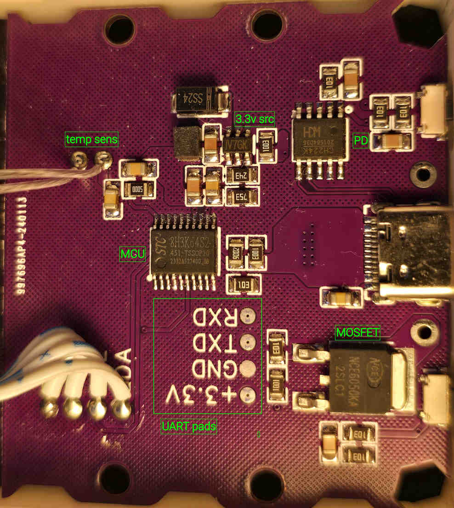

# HeatingPlate-PD

This project ports the original Keil firmware to SDCC for the STC8H3K64S2 microcontroller with few improvements.
It controls a heating plate with an OLED display, buttons, and settings stored in EEPROM.



Board pin assignments are in `src/board.h`:

| Function | Pin or Channel | Configuration |
| --- | --- | --- |
| Heater | P3.4 | Active high|
| LEFT / RIGHT buttons | P3.2 / P3.3 | Active low, open drain |
| OLED SCL / SDA | P3.5 / P3.6 | Push-pull, software I2C |
| OLED reset | P2.3 | Push-pull |
| Supply / temperature | P1.0 / P1.1, ADC0 / ADC1 | High-impedance inputs |
| Internal reference | ADC15 | Nominal 1.19 V or BGV |

## Temperature Sensor

This firmware targets a standard IEC 60751 PT100 sensor connected to ground. 
[!] There are variants of this hotplate with PT1000. 
You will need to ajust values if your sensor is different

## Requirements

- SDCC 4.6.0+
- Python 3 with `venv` support.
- [stcgal](https://github.com/grigorig/stcgal) to program the board through a USB-to-UART adapter.


```bash
sudo apt update
sudo apt install git make sdcc python3-venv
python3 -m venv "$HOME/.venvs/stcgal"
"$HOME/.venvs/stcgal/bin/python" -m pip install stcgal==1.10
```

## Build

Run the build commands from the directory that contains this README:

```bash
git submodule update --init --recursive
make
```

The build includes SDCC's `src/crtxinit.asm` with `DUAL_DPTR = 1`.
This startup routine uses two 16-bit pointers to initialize the chip's extended RAM, called XRAM.
Keep this file in the build. Do not add `--no-xinit-opt`.


## Flash

Programming replaces the installed firmware(no way to backup it).

Connect a compatible USB-to-UART adapter to the board.

When stcgal requests a power cycle, disconnect the board's power.
Restore power to let stcgal detect the chip.

Read the current chip options without programming:

```bash
sudo "$HOME/.venvs/stcgal/bin/stcgal" -P stc8d -p /dev/ttyUSB0
```


Program the firmware(it will set 45MHz clock):

```bash
sudo "$HOME/.venvs/stcgal/bin/stcgal" \
  -P stc8d \
  -t 45000 \
  -p /dev/ttyUSB0 \
  build/HeatingPlate-PD.hex
```

This command retains the existing memory split.

### Formatting

Run `make format` to format all project-owned C sources and headers in `src/` and `tests/` using `.clang-format`.
Install `clang-format` separately if needed. Run `make format-check` to check formatting without changing files.